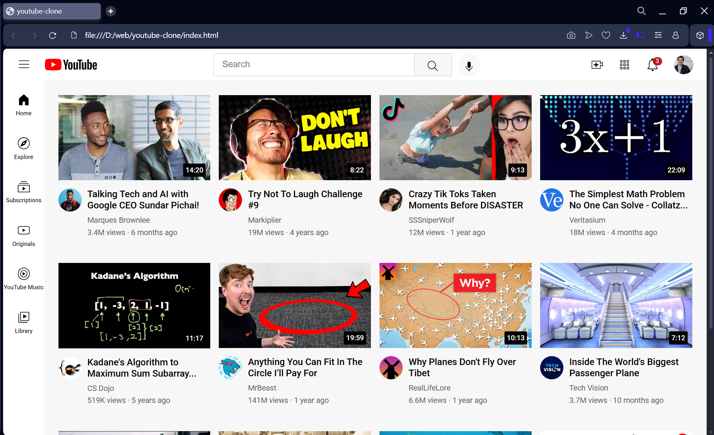

# YouTube Homepage Clone 🎥

This is a simple clone of the YouTube homepage built using HTML and CSS.  
It replicates the layout and visual style of the original homepage and is great for learning and practicing frontend development.

## 🔗 Live Demo
[Click to View Live Site](https://shiva-kkd.github.io/youtube-clone/)

## 📸 Screenshot
*(Add a screenshot image here if available)*

## 📁 Project Structure

```
youtube-clone/
├── index.html
├── channel picture/
├── icons/
├── thumbnails/
├── styles/
│   ├── general.css
│   ├── header.css
│   ├── sidebar.css
│   └── video.css
```

## 🚀 Features
- YouTube-style header, sidebar, and video grid
- Modular CSS with clean separation of components
- Responsive layout using CSS Grid and Flexbox

## 🛠️ Technologies Used
- HTML5
- CSS3

## 📸 Screenshot


## 📌 How to Run
1. Clone the repository or download the ZIP
2. Open `index.html` in your browser

## 👨‍💻 Author
**Shivananda Kkd**  
🔗 [LinkedIn](https://www.linkedin.com/in/shivananda-kokkada-96813a293)

## ⭐ Support
If you like this project, please give it a ⭐ on GitHub!